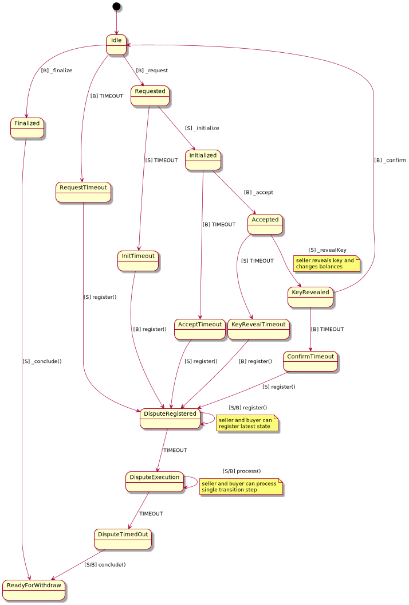

# State Channel File Sale

## Strategies

### Seller

  * **Faithful**: The seller behaves as expected, always replies and sends the correct file.
  * **Grieving**: The grieving seller waits until the buyer has made his deposit and then stops participating in the exchange.
    The seller must conduct a dispute to get his funds back.
  * **RootForging**: The seller sends a completely wrong file to the seller or uses a wrong key for encryption.
  * **NodeForging**: The seller intentionally modifies some internal hashes to try to trick the verification.
  * **LeafForging**: The seller intentionally modifies one leaf (data slice).

### Buyer

  * **Faithful**: The buyer behaves as expected, always replies and does not try to cheat or to grieve.
